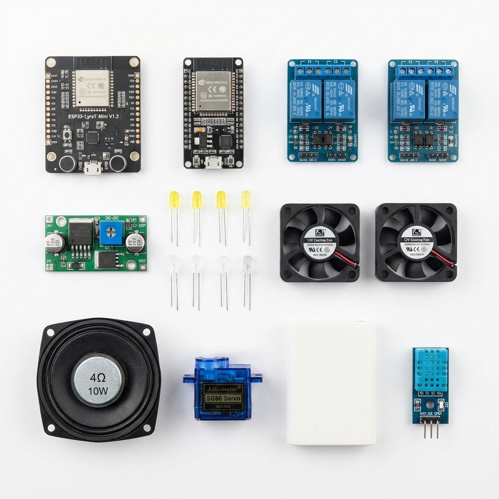
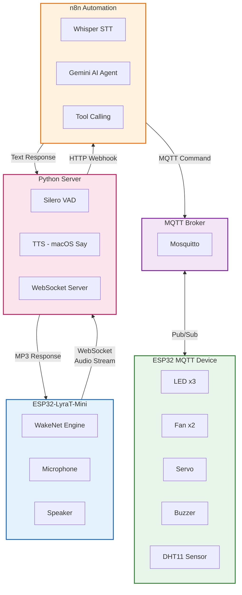
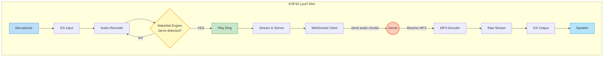
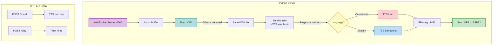
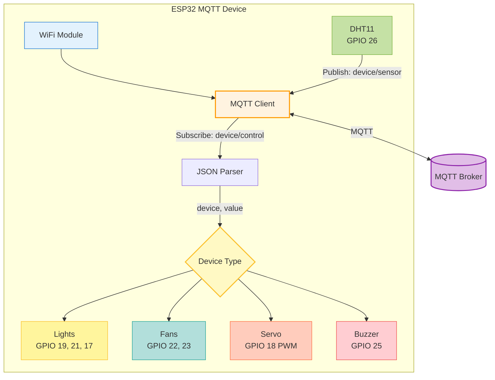
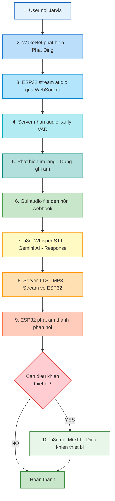
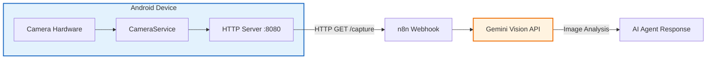
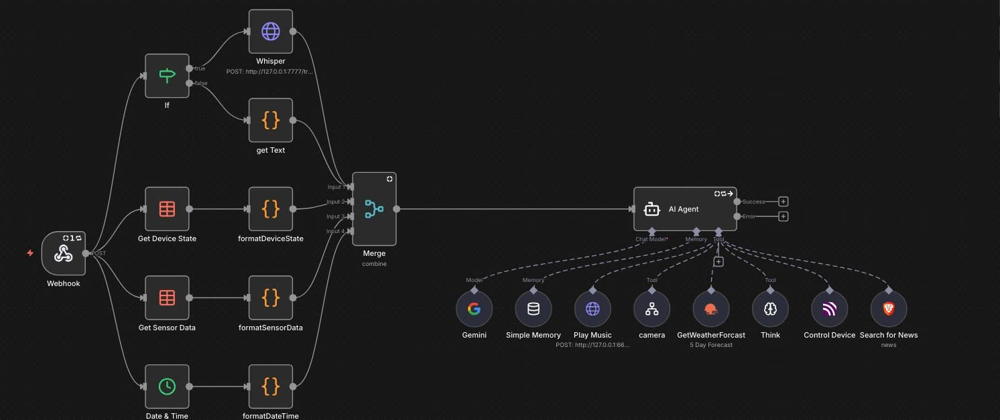

# BÁO CÁO ĐỒ ÁN IoT
## HỆ THỐNG TRỢ LÝ ẢO ĐIỀU KHIỂN THIẾT BỊ THÔNG MINH BẰNG GIỌNG NÓI

---

## THÔNG TIN NHÓM

| Thông tin | Nội dung |
|-----------|----------|
| **Nhóm** | Nhóm 8 |
| **Số thành viên** | 4 |
| **Trường** | [CẦN BỔ SUNG] |
| **Khoa** | [CẦN BỔ SUNG] |
| **Môn học** | [CẦN BỔ SUNG] |
| **GVHD** | [CẦN BỔ SUNG] |

### Danh sách thành viên và phân công công việc:

| STT | Họ và tên | MSSV | Vai trò | Công việc |
|-----|-----------|------|---------|-----------|
| 1 | **Lại Xuân Hiếu** | B22DCCN309 | Nhóm trưởng | Server + n8n Integration |
| 2 | Nguyễn Việt Huy | B22DCCN393 | Thành viên | Camera Android |
| 3 | Vũ Đức Thành | B22DCCN801 | Thành viên | Thiết kế + Trợ lý âm thanh |
| 4 | Lê Minh Ngọc | B22DCCN586 | Thành viên | Điều khiển thiết bị |

---

## MỤC LỤC

1. [Tổng quan đề tài](#chương-1-tổng-quan-đề-tài)
2. [Cơ sở lý thuyết](#chương-2-cơ-sở-lý-thuyết)
3. [Thiết kế hệ thống](#chương-3-thiết-kế-hệ-thống)
4. [Triển khai hệ thống](#chương-4-triển-khai-hệ-thống)
5. [Kết quả và đánh giá](#chương-5-kết-quả-và-đánh-giá)
6. [Kết luận](#chương-6-kết-luận)
7. [Tài liệu tham khảo](#tài-liệu-tham-khảo)

---

## CHƯƠNG 1: TỔNG QUAN ĐỀ TÀI

### 1.1 Đặt vấn đề

Trong thời đại công nghệ 4.0, việc điều khiển thiết bị thông minh bằng giọng nói đã trở thành xu hướng tất yếu. Các hệ thống như Amazon Alexa, Google Assistant đã chứng minh tiềm năng to lớn của công nghệ này. Tuy nhiên, các giải pháp này thường:
- Phụ thuộc vào cloud nước ngoài
- Chi phí cao
- Không tùy biến được

Xuất phát từ nhu cầu thực tế, nhóm đã xây dựng **Hệ thống trợ lý ảo IoT điều khiển thiết bị thông minh bằng giọng nói** với khả năng:
- Nhận diện từ khóa đánh thức (Wake Word)
- Nhận diện giọng nói tiếng Việt
- Điều khiển thiết bị qua MQTT
- Tích hợp AI để xử lý ngôn ngữ tự nhiên

### 1.2 Mục tiêu đề tài

**Mục tiêu chính:**
- Xây dựng hệ thống trợ lý ảo điều khiển thiết bị IoT bằng giọng nói tiếng Việt

**Mục tiêu cụ thể:**
1. Thiết kế và triển khai module nhận diện từ khóa đánh thức "Jarvis" trên ESP32
2. Xây dựng server xử lý giọng nói với VAD (Voice Activity Detection)
3. Tích hợp Speech-to-Text và Text-to-Speech hỗ trợ tiếng Việt
4. Phát triển module điều khiển thiết bị qua giao thức MQTT
5. Tích hợp AI (Gemini) xử lý ngôn ngữ tự nhiên qua n8n

### 1.3 Phạm vi đề tài

**Phạm vi thực hiện:**
- Điều khiển 3 đèn LED (bật/tắt/nhấp nháy)
- Điều khiển 2 quạt
- Điều khiển servo (cửa)
- Điều khiển buzzer (báo động)
- Đọc cảm biến nhiệt độ/độ ẩm DHT11
- Phát nhạc từ YouTube

**Giới hạn:**
- Hoạt động trong mạng LAN/DDNS
- Yêu cầu server Python chạy liên tục

### 1.4 Ý nghĩa thực tiễn

- Ứng dụng trong nhà thông minh (Smart Home)
- Hỗ trợ người khuyết tật điều khiển thiết bị
- Tiết kiệm năng lượng thông qua tự động hóa
- Nền tảng mở để phát triển thêm tính năng

---

## CHƯƠNG 2: CƠ SỞ LÝ THUYẾT

### 2.1 Tổng quan về IoT

**Internet of Things (IoT)** là mạng lưới các thiết bị vật lý được kết nối và trao đổi dữ liệu qua Internet. Các thành phần chính:
- **Thiết bị/cảm biến**: Thu thập dữ liệu
- **Kết nối**: WiFi, Bluetooth, LoRa...
- **Xử lý dữ liệu**: Edge computing, Cloud
- **Giao diện người dùng**: App, Web, Voice

### 2.2 ESP32 và ESP-ADF

#### 2.2.1 ESP32
- Vi điều khiển 32-bit dual-core Xtensa LX6
- Tần số: 240MHz
- RAM: 520KB SRAM + 4MB PSRAM
- Tích hợp WiFi 802.11 b/g/n và Bluetooth 4.2
- Hỗ trợ nhiều giao thức: I2C, SPI, UART, I2S

#### 2.2.2 ESP32-LyraT-Mini
Board phát triển audio của Espressif với:
- ESP32-WROVER-E module
- Codec ES8311 cho ghi/phát âm thanh
- 2 microphone analog
- Amplifier 3W
- Nút nhấn và LED

#### 2.2.3 ESP-ADF (Audio Development Framework)
Framework phát triển ứng dụng audio cho ESP32:
- Audio Pipeline: Xử lý luồng audio
- Audio Element: Các thành phần xử lý (decoder, encoder, filter)
- Speech Recognition: Nhận diện giọng nói và từ khóa
- Audio HAL: Abstraction layer cho codec

### 2.3 Wake Word Detection

**Wake Word (Từ khóa đánh thức)** là kỹ thuật nhận diện từ/cụm từ cụ thể để kích hoạt trợ lý ảo.

**WakeNet** của Espressif:
- Chạy on-device, không cần cloud
- Hỗ trợ custom wake word
- Độ chính xác cao với tiêu thụ năng lượng thấp
- Sử dụng LSTM/GRU neural network

### 2.4 Voice Activity Detection (VAD)

**VAD** phát hiện khi nào có giọng nói trong audio stream:
- Giảm băng thông truyền
- Tiết kiệm năng lượng
- Cải thiện chất lượng nhận diện

**Silero VAD** (sử dụng trong dự án):
- Model nhẹ, chạy realtime
- Độ chính xác cao
- Hỗ trợ PyTorch

### 2.5 Giao thức MQTT

**MQTT (Message Queuing Telemetry Transport)**:
- Giao thức publish/subscribe
- Nhẹ, phù hợp IoT
- QoS đảm bảo tin cậy
- Broker trung gian

**Mô hình hoạt động:**


### 2.6 WebSocket Protocol

**WebSocket** cho phép giao tiếp hai chiều, full-duplex:
- Kết nối persistent
- Độ trễ thấp
- Phù hợp streaming realtime

### 2.7 Text-to-Speech và Speech-to-Text

**TTS (Text-to-Speech)**:
- Chuyển văn bản thành giọng nói
- macOS Say command (Linh voice - tiếng Việt)

**STT (Speech-to-Text)**:
- Chuyển giọng nói thành văn bản
- Whisper (OpenAI) hoặc tích hợp qua n8n

### 2.8 n8n Workflow Automation

**n8n** là nền tảng automation workflow:
- Self-hosted, mã nguồn mở
- Kết nối nhiều dịch vụ
- Tích hợp AI (Gemini, ChatGPT)
- Xử lý webhook

---

## CHƯƠNG 3: THIẾT KẾ HỆ THỐNG

### 3.0 Danh sách thiết bị phần cứng



*Hình 3.0: Các linh kiện phần cứng sử dụng trong hệ thống*

| STT | Thiết bị | Số lượng | Thông số | Chức năng |
|-----|----------|----------|----------|-----------|
| 1 | ESP32-LyraT-Mini V1.2 | 1 | Dual-core 240MHz, 4MB PSRAM | Board xử lý âm thanh, Wake Word |
| 2 | ESP32-WROOM-32 | 1 | Dual-core 240MHz, 4MB Flash | Board điều khiển thiết bị |
| 3 | Relay Module | 2 | 5V, 10A | Đóng ngắt tải điện |
| 4 | Mạch tăng áp (Boost Converter) | 1 | 5V -> 12V, 3A | Cấp nguồn cho quạt 12V |
| 5 | LED | 8 | 3.3V | Đèn chiếu sáng |
| 6 | Quạt DC | 2 | 12V | Làm mát |
| 7 | Loa | 1 | 4ohm, 10W | Phát âm thanh phản hồi |
| 8 | Servo Motor | 1 | SG90, 5V | Điều khiển cửa/cổng |
| 9 | Pin dự phòng (Power Bank) | 1 | 5V, 10000mAh | Nguồn điện di động |
| 10 | Cảm biến DHT11 | 1 | 3.3V-5V | Đo nhiệt độ, độ ẩm |

**Tổng chi phí ước tính:** ~500.000 - 700.000 VNĐ

### 3.1 Kiến trúc tổng quan



### 3.2 Sơ đồ khối chức năng

#### 3.2.1 Module Wake Word (ESP32-LyraT-Mini)



#### 3.2.2 Module Server



#### 3.2.3 Module Device Control (ESP32 MQTT)



### 3.3 Sơ đồ kết nối phần cứng

#### 3.3.1 Mô hình sản phẩm


*Hình 3.1: Mô hình tổng thể hệ thống trợ lý ảo IoT*

#### 3.3.2 ESP32 Device Control

| Thiết bị | GPIO | Mô tả |
|----------|------|-------|
| Light 1 | GPIO 19 | Đèn LED 1 |
| Light 2 | GPIO 21 | Đèn LED 2 |
| Light 3 | GPIO 17 | Đèn LED 3 |
| Fan 1 | GPIO 22 | Quạt 1 |
| Fan 2 | GPIO 23 | Quạt 2 |
| Servo | GPIO 18 | Servo cửa (PWM) |
| Buzzer | GPIO 25 | Còi báo động |
| DHT11 | GPIO 26 | Cảm biến nhiệt độ/độ ẩm |
| WiFi LED | GPIO 2 | LED trạng thái WiFi |


### 3.4 Luồng xử lý chính



---

## CHƯƠNG 4: TRIỂN KHAI HỆ THỐNG

### 4.1 Cấu trúc mã nguồn

```
LyratMini_RecordPlay/
├── main/
│   ├── main_ws.c        # Code chính ESP32 Wake Word
│   ├── config.h         # Cấu hình WiFi, WebSocket, Audio
│   ├── settings.c/h     # Lưu trữ cài đặt NVS
│   └── wifi_helper.c/h  # Hỗ trợ kết nối WiFi
├── server/
│   ├── server_streaming_n8n.py  # Server Python chính
│   ├── requirements.txt         # Dependencies
│   └── start_streaming_n8n.sh   # Script khởi động
├── mqtt_device/
│   └── main/
│       └── main.c       # Code ESP32 điều khiển thiết bị
├── CMakeLists.txt
├── sdkconfig.defaults
└── partitions.csv
```

### 4.2 Cấu hình hệ thống

#### 4.2.1 File config.h (ESP32 Wake Word)

```c
// WiFi Configuration
#define WIFI_SSID               "Nguyen Van Hai"
#define WIFI_PASS               "0964822864"

// WebSocket Configuration
#define WS_URI                  "ws://laihieu2714.ddns.net:6666"
#define WS_BUFFER_SIZE          (128 * 1024)

// Audio Configuration
#define REC_SAMPLE_RATE         16000
#define PLAY_SAMPLE_RATE        48000

// Buffer Sizes (PSRAM)
#define RAW_WRITE_BUFFER_SIZE   (2 * 1024 * 1024)
#define AUDIO_CHUNK_SIZE        8192
```

#### 4.2.2 Cấu hình Server Python

```python
PORT = 6666              # WebSocket port
HTTP_PORT = 6667         # HTTP API port
N8N_WEBHOOK_URL = "http://localhost:5678/webhook/..."

# VAD Settings
SILENCE_CHUNKS = 6       # Số chunks im lặng để dừng
MIN_RECORDING_CHUNKS = 8 # Số chunks tối thiểu
VAD_THRESHOLD = 0.4      # Ngưỡng phát hiện giọng nói
```

### 4.3 Các chức năng chính

#### 4.3.1 Wake Word Detection

```c
// Khởi tạo WakeNet
recorder_sr_cfg_t sr_cfg = DEFAULT_RECORDER_SR_CFG(
    "LM", "model", AFE_TYPE_SR, AFE_MODE_HIGH_PERF
);
sr_cfg.afe_cfg->wakenet_init = true;
sr_cfg.afe_cfg->vad_init = false;

// Callback khi phát hiện Wake Word
static esp_err_t recorder_cb(audio_rec_evt_t *event, void *user_data) {
    if (event->type == AUDIO_REC_WAKEUP_START) {
        ESP_LOGI(TAG, "JARVIS detected!");
        play_ding();
        set_state(STATE_STREAMING);
        // Start streaming audio to server
    }
    return ESP_OK;
}
```

#### 4.3.2 Audio Streaming

```c
static void stream_task(void *arg) {
    uint8_t *buf = heap_caps_malloc(AUDIO_CHUNK_SIZE, MALLOC_CAP_SPIRAM);
    
    while (get_state() == STATE_STREAMING) {
        int len = audio_recorder_data_read(g_recorder, buf, AUDIO_CHUNK_SIZE, 50);
        if (len > 0) {
            esp_websocket_client_send_bin(g_ws, (char *)buf, len, 500);
        }
        vTaskDelay(pdMS_TO_TICKS(10));
    }
    
    esp_websocket_client_send_text(g_ws, "END", 3, 1000);
    free(buf);
}
```

#### 4.3.3 Server VAD và TTS

```python
# VAD với Silero
async def handle_client(websocket):
    audio_buffer = []
    silence_count = 0
    
    async for message in websocket:
        if isinstance(message, bytes):
            chunk = np.frombuffer(message, dtype=np.int16)
            audio_buffer.append(chunk)
            
            # VAD check
            timestamps = get_speech_timestamps(chunk, vad_model)
            if not timestamps:
                silence_count += 1
                if silence_count >= SILENCE_CHUNKS:
                    await websocket.send("STOP_RECORDING")
                    await process_audio(audio_buffer, websocket)

# TTS với macOS Say
async def tts_stream(text):
    voice = "Linh" if is_vietnamese(text) else "Samantha"
    await subprocess_exec("say", "-v", voice, "-o", temp_file, text)
    # Convert to MP3 with ffmpeg
```

#### 4.3.4 MQTT Device Control

```c
// Xử lý lệnh MQTT
if (strcmp(dev_name, "light1") == 0) {
    device_state.light1 = val;  // 0=off, 1=on, 2=blink
    save_device_state();        // Lưu vào NVS
}
else if (strcmp(dev_name, "buzzer") == 0) {
    device_state.buzzer_mode = val;  // 0=off, 1=alarm, 2=continuous
    buzzer_timeout_sec = timeout;    // Tự động tắt sau N giây
}
else if (strcmp(dev_name, "servo") == 0) {
    set_servo_angle(val);  // 120-180 độ
}
```

### 4.5 Module Camera Giám Sát (Android IP Camera)

#### 4.5.1 Giới thiệu

Module Camera Giám Sát được phát triển nhằm mở rộng khả năng nhận thức của hệ thống trợ lý ảo thông qua thị giác máy tính (Computer Vision). Giải pháp này cho phép tái sử dụng các thiết bị điện thoại Android cũ làm camera IP, giảm chi phí đầu tư phần cứng đồng thời nâng cao tính linh hoạt của hệ thống.

#### 4.5.2 Các chức năng chính

| STT | Chức năng | Mô tả kỹ thuật |
|-----|-----------|----------------|
| 1 | Chụp ảnh từ xa | RESTful API qua HTTP, endpoint `/capture` |
| 2 | Hỗ trợ đa camera | Camera chính (độ phân giải cao) và camera góc rộng (Ultra Wide) |
| 3 | Background Service | Foreground Service với Notification, duy trì hoạt động khi tắt màn hình |
| 4 | Auto-start | Broadcast Receiver lắng nghe sự kiện BOOT_COMPLETED |
| 5 | Image Streaming | Gửi ảnh định kỳ (1 giây/lần) đến n8n webhook qua HTTP POST multipart |

#### 4.5.3 Kiến trúc module



#### 4.5.4 Ứng dụng thực tế

Tích hợp với Gemini Vision API, hệ thống có khả năng xử lý các truy vấn yêu cầu phân tích hình ảnh:

| Truy vấn người dùng | Quy trình xử lý |
|---------------------|-----------------|
| "Có người ngoài cửa không?" | Chụp ảnh -> Phát hiện người (Object Detection) -> Phản hồi |
| "Nồi cơm đã bật chưa?" | Chụp ảnh khu vực bếp -> Phân tích trạng thái thiết bị -> Phản hồi |
| "Đèn phòng khách có sáng không?" | Chụp ảnh -> Phân tích mức độ ánh sáng -> Phản hồi |
| "Cửa sổ đóng hay mở?" | Chụp ảnh -> Nhận diện trạng thái cửa -> Phản hồi |

#### 4.5.5 API Specification

**Endpoint:** `GET /capture`

| Tham số | Kiểu | Mặc định | Mô tả |
|---------|------|----------|-------|
| `width` | int | 1920 | Chiều rộng ảnh đầu ra (pixels) |
| `quality` | int | 80 | Chất lượng nén JPEG (1-100) |
| `lens` | string | normal | Chọn camera: `normal` hoặc `ultrawide` |
| `zoom` | float | null | Hệ số zoom kỹ thuật số |

**Ví dụ sử dụng:**
```bash
# Chụp ảnh tiêu chuẩn
curl http://192.168.1.x:8080/capture -o image.jpg

# Chụp ảnh tối ưu cho AI (độ phân giải thấp, tải nhanh)
curl "http://192.168.1.x:8080/capture?width=640&quality=50" -o fast.jpg
```

#### 4.5.6 Tích hợp n8n Workflow

Trong workflow n8n, tool `get_camera_image` được cấu hình để:
1. Thực hiện HTTP Request đến Camera Server
2. Chuyển tiếp ảnh đến Gemini Vision API
3. Phân tích kết quả và trích xuất thông tin
4. Trả về phản hồi dạng văn bản cho module TTS

**Ưu điểm của giải pháp:**
- Tiết kiệm chi phí: Tái sử dụng thiết bị di động cũ
- Linh hoạt: Dễ dàng thay đổi vị trí đặt camera
- Chất lượng cao: Tận dụng camera smartphone với độ phân giải lên đến 48MP
- Mở rộng: Có thể triển khai nhiều camera trong cùng hệ thống

### 4.6 Tích hợp n8n

#### 4.6.1 Workflow



*Hình 4.1: Workflow xử lý giọng nói trên n8n*

**Các node chính:**
1. **Webhook** - Nhận audio từ server
2. **OpenAI Whisper** - Chuyển audio -> text
3. **Gemini AI Agent** - Xử lý ngôn ngữ tự nhiên
4. **MQTT** - Gửi lệnh điều khiển thiết bị
5. **Respond to Webhook** - Trả về text response

#### 4.6.2 AI Tools
```json
{
  "tools": [
    {"name": "control_light", "params": ["light_id", "state"]},
    {"name": "control_fan", "params": ["fan_id", "state"]},
    {"name": "control_door", "params": ["angle"]},
    {"name": "control_buzzer", "params": ["mode", "timeout"]},
    {"name": "get_sensor", "params": []},
    {"name": "play_music", "params": ["query"]}
  ]
}
```

#### 4.6.3 Ưu điểm của n8n so với các trợ lý ảo khác

Việc sử dụng **n8n** làm nền tảng xử lý AI mang lại nhiều ưu điểm vượt trội so với các giải pháp trợ lý ảo phổ biến trên thị trường:

| Tiêu chí | Hệ thống của nhóm (n8n) | Amazon Alexa | Google Assistant | Apple Siri |
|----------|-------------------------|--------------|------------------|------------|
| **Tự host** | Self-hosted | Cloud Amazon | Cloud Google | Cloud Apple |
| **Chi phí** | Miễn phí | Trả phí API | Trả phí API | Không mở API |
| **Tùy biến AI** | Chọn bất kỳ LLM | Cố định | Cố định | Cố định |
| **Mở rộng Tools** | Không giới hạn | Giới hạn Skills | Giới hạn Actions | Rất hạn chế |
| **Tích hợp dịch vụ** | 400+ nodes | Ecosystem Amazon | Ecosystem Google | Ecosystem Apple |
| **Quyền riêng tư** | Dữ liệu local | Gửi lên cloud | Gửi lên cloud | Gửi lên cloud |
| **Mã nguồn mở** | Open source | Closed | Closed | Closed |

**Khả năng mở rộng với n8n:**

1. **Thay đổi AI Model dễ dàng**
   - Chuyển từ Gemini sang ChatGPT, Claude, Llama chỉ bằng 1 click
   - Không cần sửa code ESP32 hay Server

2. **Thêm Tools/Chức năng mới**
   - Kéo thả node mới trong giao diện visual
   - Ví dụ: Thêm điều khiển camera, gửi email, đọc lịch...

3. **Tích hợp đa nền tảng**
   - Kết nối Telegram, Discord, Slack để điều khiển từ xa
   - Tích hợp Home Assistant, Tuya, Xiaomi...
   - Kết nối database, API bên thứ 3

4. **Workflow linh hoạt**
   - Tạo kịch bản phức tạp (nếu nhiệt độ > 30°C -> bật quạt + thông báo)
   - Lập lịch tự động hóa

5. **Debug và Monitor**
   - Xem logs chi tiết từng bước
   - Test từng node riêng lẻ

---

## CHƯƠNG 5: KẾT QUẢ VÀ ĐÁNH GIÁ

### 5.1 Kết quả đạt được

#### 5.1.1 Chức năng hoàn thành

| STT | Chức năng | Trạng thái | Ghi chú |
|-----|-----------|------------|---------|
| 1 | Wake Word Detection | Hoàn thành | "Jarvis" |
| 2 | Audio Streaming | Hoàn thành | WebSocket |
| 3 | VAD (Voice Activity Detection) | Hoàn thành | Silero VAD |
| 4 | Speech-to-Text | Hoàn thành | Whisper qua n8n |
| 5 | Text-to-Speech | Hoàn thành | macOS Say (VI/EN) |
| 6 | AI Processing | Hoàn thành | Gemini |
| 7 | Điều khiển đèn | Hoàn thành | 3 đèn, 3 chế độ |
| 8 | Điều khiển quạt | Hoàn thành | 2 quạt |
| 9 | Điều khiển servo | Hoàn thành | Cửa 120-180° |
| 10 | Điều khiển buzzer | Hoàn thành | 3 chế độ + timeout |
| 11 | Đọc cảm biến DHT11 | Hoàn thành | Nhiệt độ, độ ẩm |
| 12 | Phát nhạc YouTube | Hoàn thành | yt-dlp |
| 13 | Lưu trạng thái NVS | Hoàn thành | Khôi phục sau reset |
| 14 | Barge-in | Hoàn thành | Ngắt phát khi nói |

#### 5.1.2 Demo

> [CẦN VIDEO/GIF: Demo hệ thống hoạt động]

**Các câu lệnh mẫu:**
- "Jarvis, bật đèn 1"
- "Jarvis, tắt tất cả quạt"
- "Jarvis, nhiệt độ phòng bao nhiêu?"
- "Jarvis, mở cửa"
- "Jarvis, bật báo động"
- "Jarvis, phát bài Chúng Ta Của Hiện Tại"

### 5.2 Đánh giá hiệu năng

#### 5.2.1 Độ trễ (Latency)

| Giai đoạn | Thời gian |
|-----------|-----------|
| Wake Word Detection | ~100ms |
| Audio Streaming -> Server | ~50ms |
| VAD Processing | ~200ms |
| STT (Whisper) | ~1-2s |
| AI Processing (Gemini) | ~1-2s |
| TTS Generation | ~500ms |
| Audio Playback | ~100ms |
| **Tổng End-to-End** | **~4-5s** |

#### 5.2.2 Độ chính xác

| Tiêu chí | Kết quả |
|----------|---------|
| Wake Word Recognition | ~95% |
| Speech-to-Text (tiếng Việt) | ~90% |
| Intent Understanding | ~85% |
| Device Control Success | ~98% |

### 5.3 Hạn chế

1. **Phụ thuộc mạng**: Cần kết nối WiFi ổn định
2. **Độ trễ**: 4-5s cho toàn bộ pipeline
3. **Tiếng ồn**: Ảnh hưởng đến độ chính xác STT
4. **Server**: Cần máy chủ chạy liên tục

---

## CHƯƠNG 6: KẾT LUẬN

### 6.1 Kết luận

Nhóm đã hoàn thành xây dựng **Hệ thống trợ lý ảo điều khiển thiết bị thông minh bằng giọng nói** với các kết quả:

**Đạt được:**
- Nhận diện từ khóa đánh thức "Jarvis" on-device
- Streaming audio realtime qua WebSocket
- VAD tự động phát hiện kết thúc câu nói
- STT/TTS hỗ trợ tiếng Việt
- Tích hợp AI (Gemini) xử lý ngôn ngữ tự nhiên
- Điều khiển đa dạng thiết bị qua MQTT
- Lưu trữ trạng thái thiết bị (NVS)
- Barge-in (ngắt phát khi có wake word mới)

**Ý nghĩa:**
- Chứng minh khả năng xây dựng hệ thống trợ lý ảo với chi phí thấp
- Nền tảng mở để phát triển thêm tính năng
- Có thể ứng dụng thực tế trong nhà thông minh

### 6.2 Hướng phát triển

1. **Cải thiện độ trễ**: Sử dụng Edge AI, local STT
2. **Tăng độ chính xác**: Noise cancellation, AEC
3. **Mở rộng thiết bị**: Camera, cảm biến khác
4. **Giao diện quản lý**: Dashboard web/mobile
5. **Multi-room**: Nhiều ESP32 trong một hệ thống
6. **Offline mode**: Chạy hoàn toàn local

---

## TÀI LIỆU THAM KHẢO

1. Espressif Systems. (2023). *ESP-IDF Programming Guide*. https://docs.espressif.com/projects/esp-idf/
2. Espressif Systems. (2023). *ESP-ADF Documentation*. https://docs.espressif.com/projects/esp-adf/
3. Espressif Systems. (2023). *WakeNet Documentation*. https://github.com/espressif/esp-sr
4. Silero Team. (2023). *Silero VAD*. https://github.com/snakers4/silero-vad
5. OpenAI. (2023). *Whisper*. https://github.com/openai/whisper
6. MQTT.org. (2023). *MQTT Protocol Specification*. https://mqtt.org/
7. n8n.io. (2023). *n8n Documentation*. https://docs.n8n.io/

---

## PHỤ LỤC

### Phụ lục A: Hướng dẫn cài đặt

#### A.1 ESP32-LyraT-Mini

```bash
# Clone ESP-ADF
git clone --recursive https://github.com/espressif/esp-adf.git
cd esp-adf
git checkout v2.6

# Build và flash
cd /path/to/LyratMini_RecordPlay
idf.py build
idf.py -p /dev/ttyUSB0 flash monitor
```

#### A.2 Server Python

```bash
cd server
python -m venv venv
source venv/bin/activate
pip install -r requirements.txt
python server_streaming_n8n.py
```

#### A.3 ESP32 MQTT Device

```bash
cd mqtt_device
idf.py build
idf.py -p /dev/ttyUSB1 flash monitor
```

### Phụ lục B: Cấu hình WiFi

Xem file `WIFI_CONFIG_GUIDE.md` để biết cách cấu hình WiFi qua Serial Monitor.

### Phụ lục C: MQTT Commands

```json
// Bật đèn 1
{"device": "light1", "value": 1}

// Đèn 2 nhấp nháy
{"device": "light2", "value": 2}

// Bật quạt 1
{"device": "fan1", "value": 1}

// Mở cửa 180 độ
{"device": "servo", "value": 180}

// Báo động 30 giây
{"device": "buzzer", "value": 1, "timeout": 30}
```

---

**Ngày hoàn thành:** [Ngày/Tháng/Năm]

**Xác nhận của GVHD:**

_____________________
